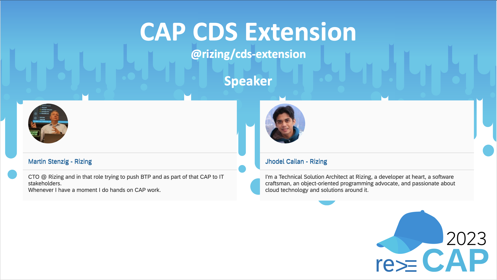
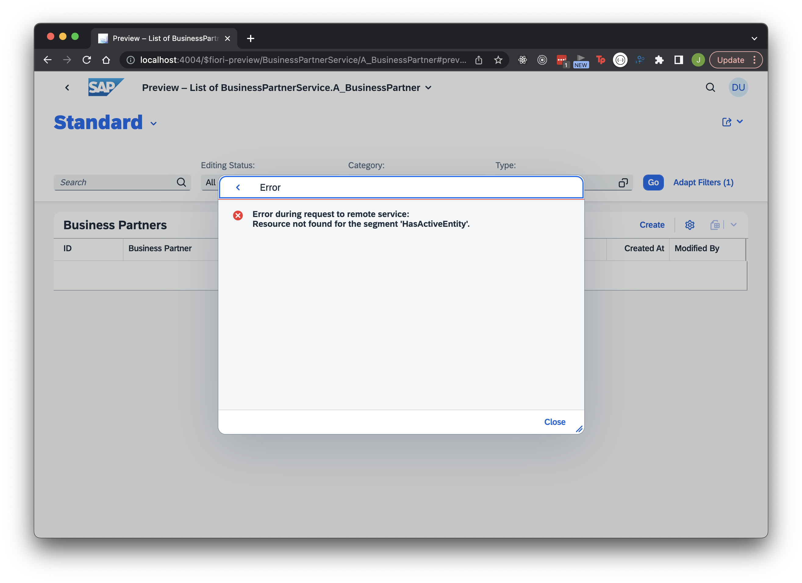

# CDSX Demo - reCAP 2023




## CAP using external service

### 1. Create CAP project

- Run CLI commands below:

```shell
# initialize CAP project
> cds init
# initialize git
> git init
# install dependencies
> npm install
```

### 2. Add external service

- Import an EDMX file generated from an S/4HANA OData Service, here we are using [API_BUSINESS_PARTNER.xml](template/API_BUSINESS_PARTNER.xml). Copy the file from [template](template) folder to your project folder, then execute the command below:

```shell
> cds import API_BUSINESS_PARTNER.xml
```

### 3. Create CDS models, handlers, and annotations

- Create the service model `BusinessPartner.cds`

```sql
using {API_BUSINESS_PARTNER as external} from './external/API_BUSINESS_PARTNER';

service BusinessPartnerService {
    entity A_BusinessPartner as projection on external.A_BusinessPartner;
}
```

- Create the annotations `annotations.cds`

```sql
using BusinessPartnerService as service from './BusinessPartner';

annotate service.A_BusinessPartner with @(
    Capabilities: {DeleteRestrictions: {Deletable: false}},
    UI          : {
        SelectionFields               : [
            BusinessPartnerCategory,
            BusinessPartnerType
        ],
        HeaderInfo                    : {
            TypeName      : '{i18n>businessPartner}',
            TypeNamePlural: '{i18n>businessPartners}',
            ImageUrl      : 'sap-icon://supplier',
            Title         : {Value: BusinessPartnerFullName},
            Description   : {Value: BusinessPartner}
        },
        LineItem                      : [
            {Value: BusinessPartner},
            {Value: BusinessPartnerFullName},
            {Value: BusinessPartnerCategory},
            {Value: BusinessPartnerType},
            {Value: Customer},
            {Value: Supplier},
            {Value: CreatedByUser},
            {Value: CreationDate},
            {Value: LastChangedByUser},
            {Value: LastChangeDate}
        ],
        Facets                        : [{
            $Type : 'UI.ReferenceFacet',
            Target: '@UI.FieldGroup#GeneralInformation',
            Label : '{i18n>generalInformation}'
        }],
        FieldGroup #GeneralInformation: {Data: [
            {Value: FirstName},
            {Value: MiddleName},
            {Value: LastName},
            {Value: BusinessPartnerCategory},
            {Value: BusinessPartnerType},
            {Value: Customer},
            {Value: Supplier}
        ]}
    }
) {
    BusinessPartner         @title: '{i18n>id}';
    BusinessPartnerFullName @title: '{i18n>businessPartner}';
    BusinessPartnerCategory @title: '{i18n>category}';
    BusinessPartnerType     @title: '{i18n>type}';
    Customer                @title: '{i18n>customer}';
    Supplier                @title: '{i18n>supplier}';
    CreatedByUser           @title: '{i18n>createdBy}';
    CreationDate            @title: '{i18n>createdAt}';
    LastChangedByUser       @title: '{i18n>modifiedBy}';
    LastChangeDate          @title: '{i18n>modifiedAt}';
    FirstName               @title: '{i18n>firstName}';
    MiddleName              @title: '{i18n>middleName}';
    LastName                @title: '{i18n>lastName}';
    BusinessPartnerUUID     @UI   : {Hidden};
    CreationTime            @UI   : {Hidden};
    LastChangeTime          @UI   : {Hidden};
    ETag                    @UI   : {Hidden};
};
```

- [Optional] Copy the [_i18n/i18n.properties](_i18n/i18n.properties) of this project to your own project.

- Install SAP Cloud SDK Client:

```shell
> npm install @sap-cloud-sdk/http-client
```

- Update cds config in `package.json` file with remote connection credentials:

```json
"cds": {
	"requires": {
		"API_BUSINESS_PARTNER": {
			"kind": "odata-v2",
			"model": "srv/external/API_BUSINESS_PARTNER",
			"[backend]": {
				"credentials": {
					"url": "{{s4h_hostname}}/sap/opu/odata/sap/API_BUSINESS_PARTNER",
					"username": "{{s4h_username}}",
					"password": "{{s4h_password}}"
				}
			}
		}
	}
}
```

- Create handler implementation

```javascript
module.exports = async service => {
	const external = await cds.connect.to("API_BUSINESS_PARTNER");

	service.on("READ", "A_BusinessPartner", async context => {
		return await external.run(context.query);
	});
};
```

- Test the app using `Fiori Preview`, but execute the command below first:

```shell
> cds watch --profile backend
```

### 4. Add `odata.draft.enabled` annotation

- Update the service model:

```sql
using {API_BUSINESS_PARTNER as external} from './external/API_BUSINESS_PARTNER';


service BusinessPartnerService {

    @odata.draft.enabled
    entity A_BusinessPartner as projection on external.A_BusinessPartner;

}
```

- Test the app while connected to backend:

```shell
> cds watch --profile backend
```

- Results into an error:



## CAP using CDSX

### 1. Install CDSX

- Install dependency

```shell
> npm install @rizing/cds-extension
```

- Bootstrap CDSX using `srv/server.js`

```javascript
const cdsx = require("@rizing/cds-extension");

cds.on("bootstrap", () => {
	cdsx.load({ config: true });
});
```

- Add CSRF Token handling flag in CDS config under `package.json` file:

```json
"features": {
	"fetch_csrf": true
}
```

### 2. Create CDS Models

- Create Data Models in `schema.cds` (i.e. **Shadow Persistence Entity**)

```sql
namespace remote;

@cdsx.api: 'API_BUSINESS_PARTNER'
entity A_BusinessPartner {
		@cdsx.object.key
	key BusinessPartner         : String(10);
		Customer                : String(10);
		Supplier                : String(10);

		@mandatory
		BusinessPartnerCategory : String(1);
		BusinessPartnerFullName : String(81);
		BusinessPartnerUUID     : UUID;
		FirstName               : String(40);
		MiddleName              : String(40);

		@mandatory
		LastName                : String(40);
		BusinessPartnerType     : String(4);
		ETag                    : String(26);
		CreatedByUser           : String(12);
		CreationDate            : Date;
		CreationTime            : Time;
		LastChangedByUser       : String(12);
		LastChangeDate          : Date;
		LastChangeTime          : Time;
}
```

- Update Service Model to use the **Shadow Persistence Entity**

```sql
using {remote} from '../db/schema';

service BusinessPartnerService {

    @odata.draft.enabled
    entity A_BusinessPartner as projection on remote.A_BusinessPartner;

}
```

- Delete the custom handler implementation `srv/BusinessPartner.js`

### 3. [Optional] Use `.env` to store credentials

- Remote source config in `package.json` should use placeholders for environment variables like the ones below:

```json
"requires": {
	"API_BUSINESS_PARTNER": {
		"kind": "odata-v2",
		"model": "srv/external/API_BUSINESS_PARTNER",
		"[backend]": {
			"credentials": {
				"url": "{{s4h_hostname}}/sap/opu/odata/sap/API_BUSINESS_PARTNER",
				"username": "{{s4h_username}}",
				"password": "{{s4h_password}}"
			}
		}
	}
}
```

- Create a `.env` file to store the environment variables with the following template (and provide your on-premise system credentials):

```properties
s4h_hostname=
s4h_username=
s4h_password=
```

> **NOTE:** The `.env` file should be ignored by git since it contains sensitive information.